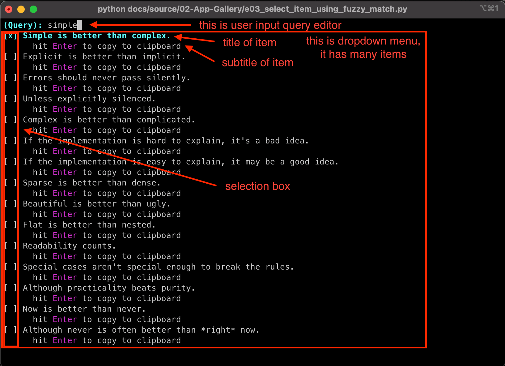

What is This
==============================================================================
``zelfred`` is a framework for building interactive applications similar to `Alfred Workflow <https://www.alfredapp.com/workflows/>`_, but in Python and for the terminal. It is free, open source, and cross-platform.

Below is a sample ``zelfred`` App.

The UI has two components:

1. **user input query editor**: it is a one-line text editor that allows user to enter the query.
2. **dropdown menu**: it has a list of item and allow user to select item from the list.

App developers can use their imagination to define the logic for generating the list of items based on the input query, and ``zelfred`` will take care of the rest, including user interaction, rendering, and keyboard event handling.

You can view more sample applications in the :ref:`app-gallery`.
